  <nav id="mainNavbar" class="navbar navbar-expand-lg fixed-top navbar-dark bg-dark clearfix">

    <button class="navbar-toggler" type="button" data-toggle="collapse" data-target="#navbarNavAltMarkup"
      aria-controls="navbarNavAltMarkup" aria-expanded="false" aria-label="Toggle navigation">
      

    </button>
    <a class="navbar-brand" href="#"><i class="fas fa-hammer"></i></a>

    

      

        <li class="nav-item dropdown">
          <a class="nav-link dropdown-toggle" href="#" id="navbarDropdown" role="button" data-toggle="dropdown"
            aria-haspopup="true" aria-expanded="false">
            Galleria
          </a>
          

            <a class="dropdown-item" href="#Pesuhuoneet">Pesuhuoneet</a>
            <a class="dropdown-item" href="#Keittiöt">Keittiöt</a>
            <a class="dropdown-item" href="#Muut">Muut</a>
          

        </li>
        <a class="nav-item nav-link" href="#yhteystiedot">Yhteystiedot</a>

      

    

  </nav>

  

    

        <section class="container-fluid px-0">
        

          

            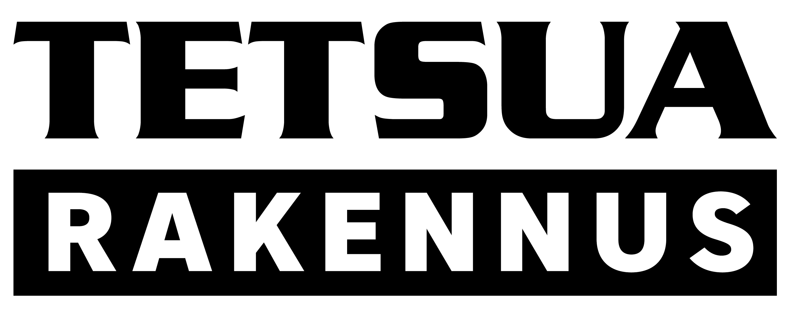

          

          

            

              

                <h1 id="yritys">Yritys</h1>

                
TETSUA rakennus on Pirkanmaan alueella palveleva rakennusyritys. 
                   Olen aloittanut yrittäjänä vuoden 2020 alussa.
                  Rakennusalasta on kertynyt monipuolinen osaaminen 13 vuoden aikana erilaisissa kohteissa,
                  aina pienestä pintaremontista vauriokorjausten kautta uudisrakentamiseen. 
                    Uudisrakentamisesta, joka on
                  lähinnä sydäntäni löytyy kokonaisvaltaista osaamista
                  niin omakotitaloista kuin autotalleista.

                

                <h3>Ota yhteyttä:</h3>
                

                  <strong>TETSUA rakennus</strong>
                   
                  Ville Sinkkonen
                   
                  <i class="fas fa-phone-alt"></i>
                  <a href="tel:+358504049421">050-404 9421</a>

                   
                  <a href="mailto:tetsuarakennus@gmail.com">tetsuarakennus@gmail.com</a>

                

                

                   

                  <a id="insta" href="https://www.instagram.com/tetsuarakennus/" target="_blank"><i
                      class="fab fa-instagram fa-2x"></i></a>

                

              

            

          

        

      </section>
    

  

  

    <section class="container-fluid px-0">
      

        

          

            

              

                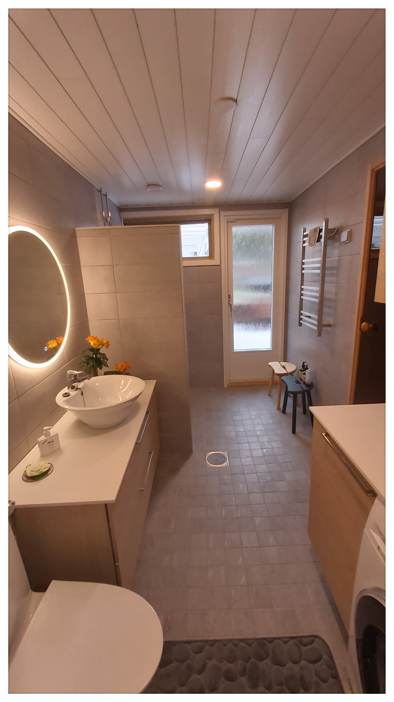
              

              

                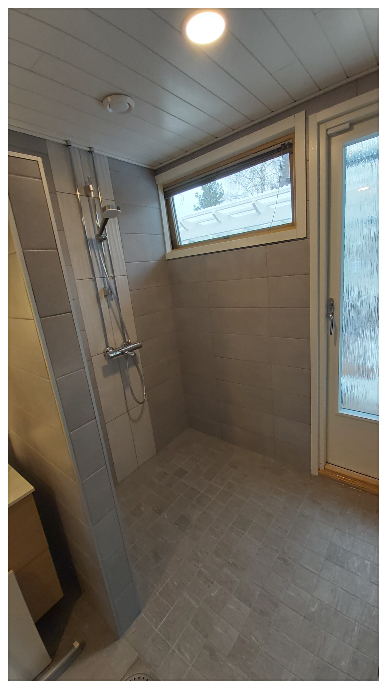
              

              

                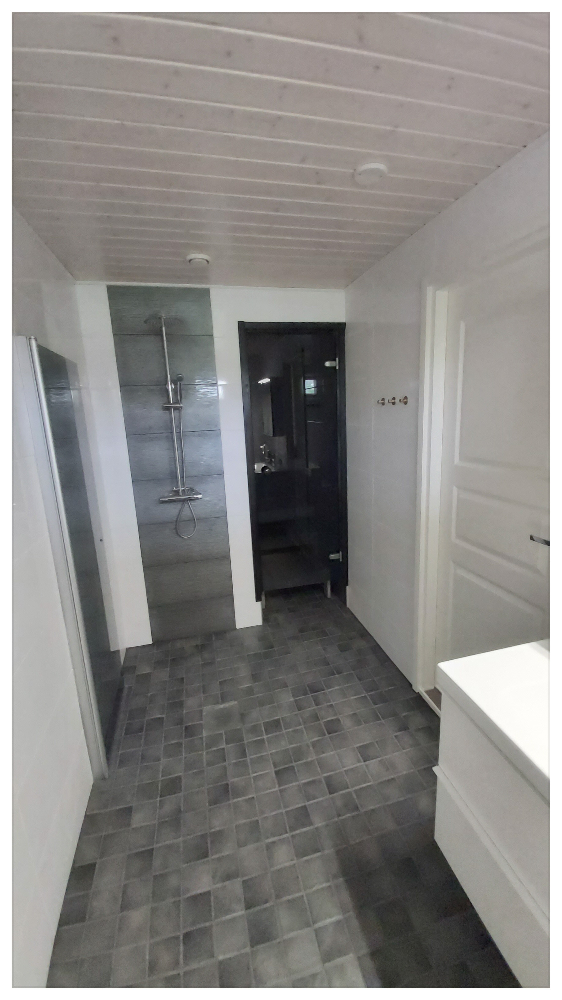
              

              

                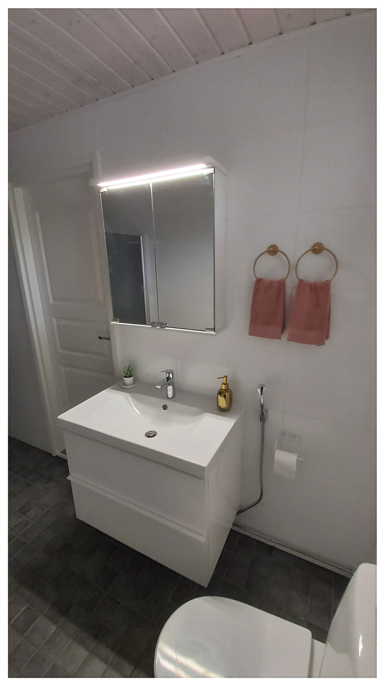
              

              

                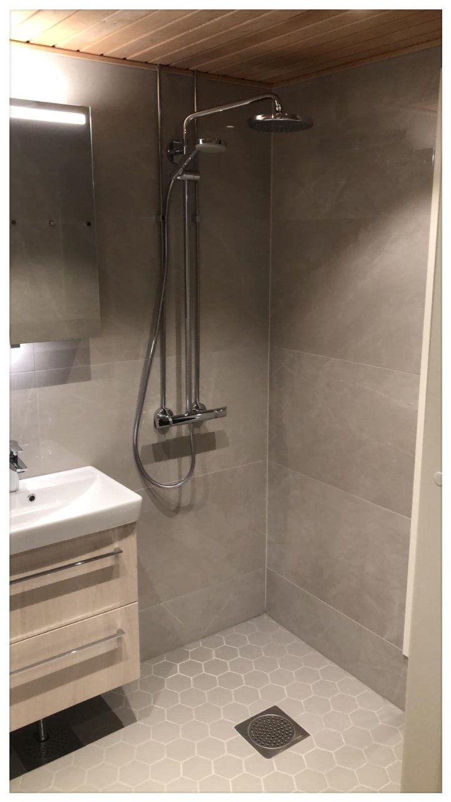
              

              <a class="carousel-control-prev" href="#carouselExampleControls1" role="button" data-slide="prev">
                
                Previous
              </a>
              <a class="carousel-control-next" href="#carouselExampleControls1" role="button" data-slide="next">
                
                Next
              </a>
            

          

        

        

          

            

              <h2>Pesuhuoneet</h2>
              
              
Teen ammattitaidolla asiakkaan toiveiden mukaisia ja laadukkaita kylpyhuonekokonaisuuksia.
                  Hyvään lopputulokseen
                päästään aina huolellisen etukäteissuunnitelun kautta, joka voidaan toteuttaa myös yhteistyöyrityksen
                kautta
                3D-mallinnuksena.
                  Aikaisempi työskentely
                sisustustimpurina takaa laadukkaan viimeistelyn ja näyttävän lopputuloksen.
              

            

          

          

         

  

  

    <section class="container-fluid px-0">
      

        

          

            

              

                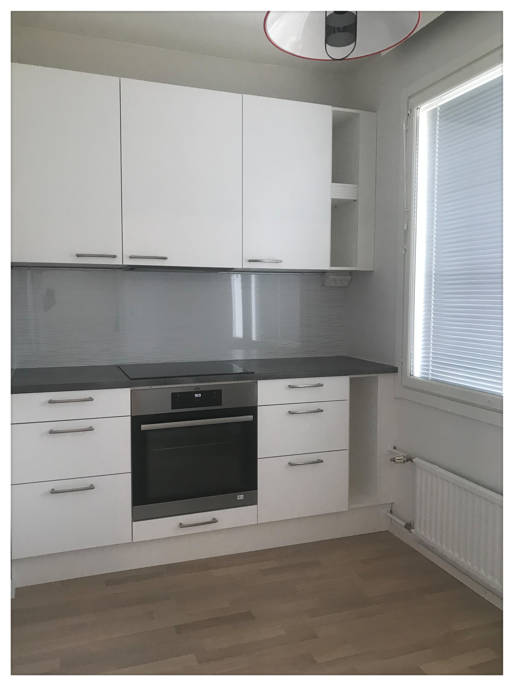
              

              

                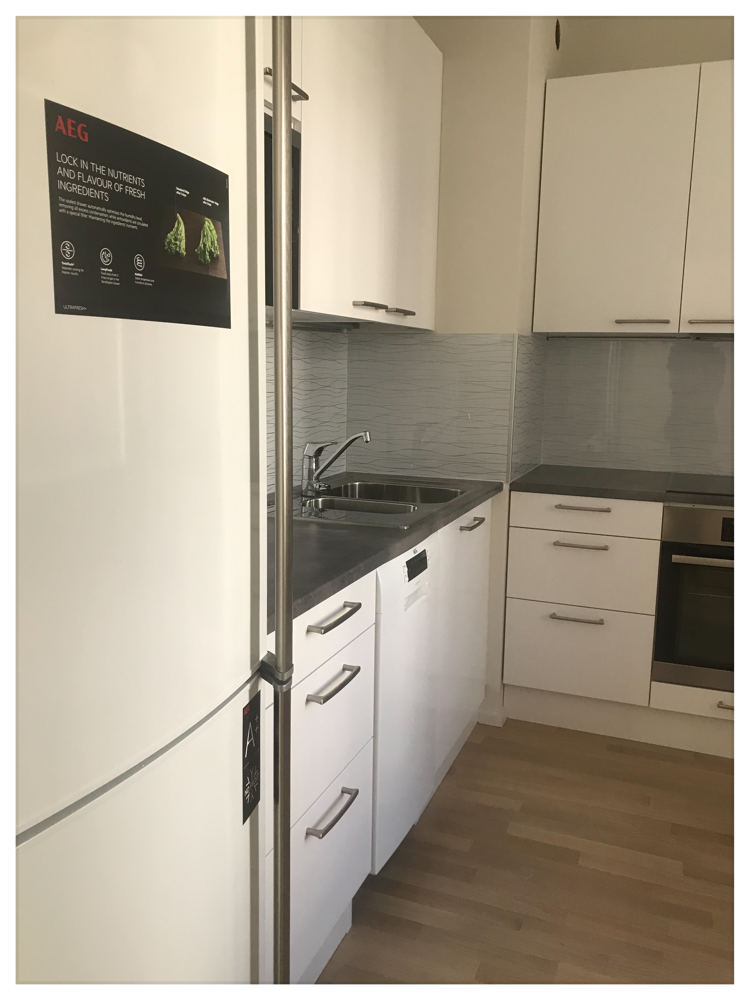
              

              

                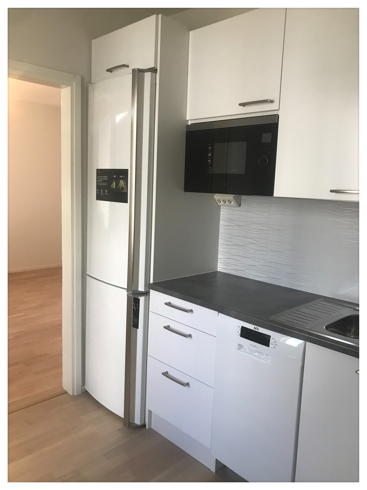
              

              

                
              

              

                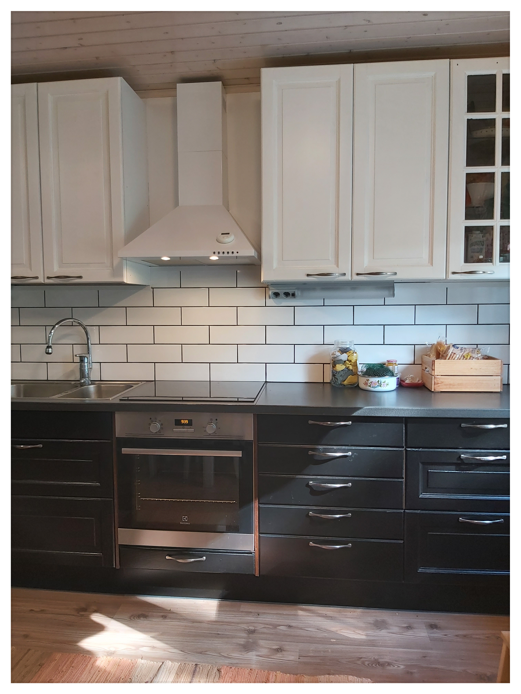
              

              

                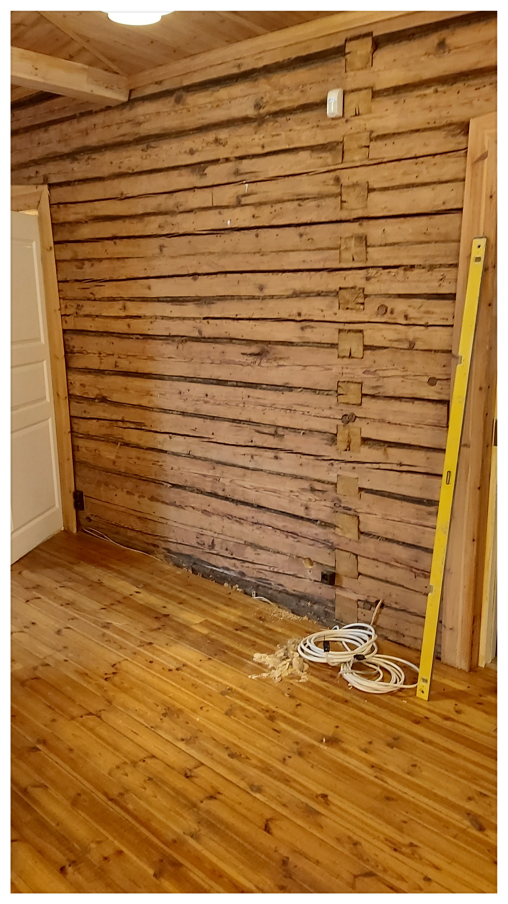
              

              

                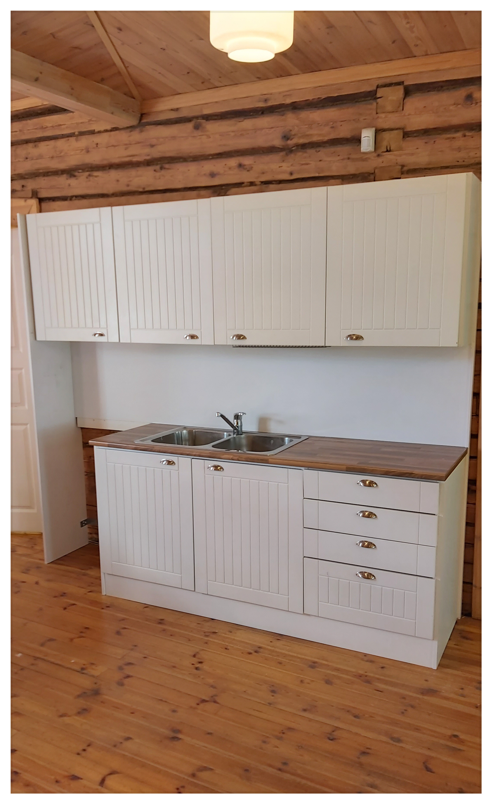
              

              <a class="carousel-control-prev" href="#carouselExampleControls2" role="button" data-slide="prev">
                
                Previous
              </a>
              <a class="carousel-control-next" href="#carouselExampleControls2" role="button" data-slide="next">
                
                Next
              </a>
            

          

        

        

          

            

              <h2>Keittiöt</h2>
              
              
Keittiö on iso osa arkea. Vanhaan keittiöön voidaan uusia kaikki kalusteet ja kodinkoneet,
                mutta myös pienellä päivityksellä saadaan uutta ilmettä ja käyttöikää pidennettyä.
              

            

          

 
  

  

    <section class="container-fluid px-0">
      

        

          

            

              

                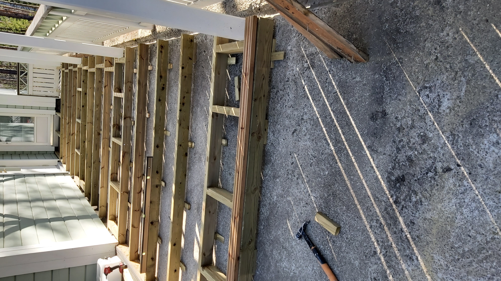
              

              

                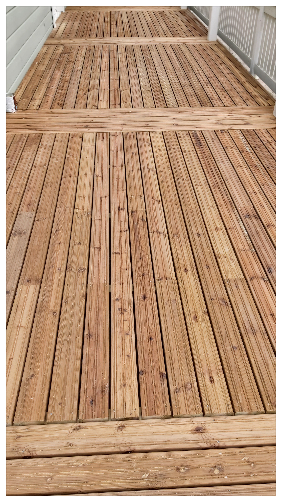
              

              

                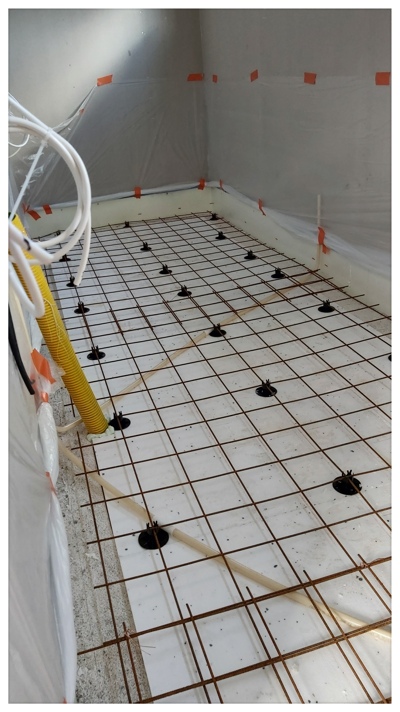
              

              

                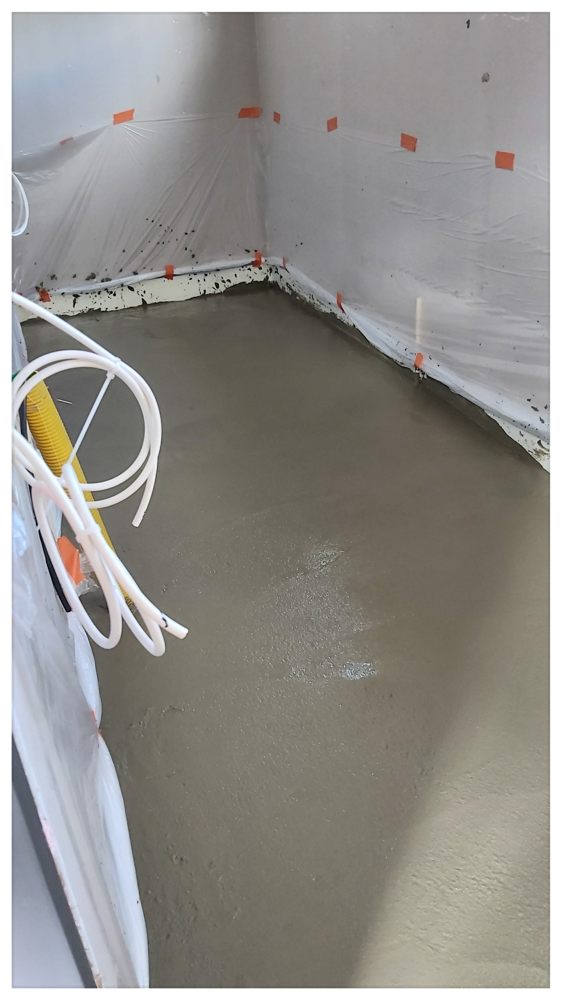
              

              

                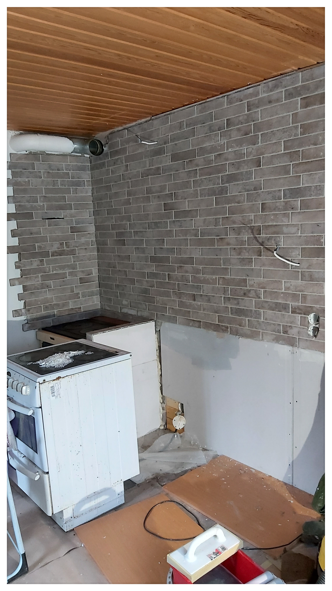
              

              <a class="carousel-control-prev" href="#carouselExampleControls3" role="button" data-slide="prev">
                
                Previous
              </a>
              <a class="carousel-control-next" href="#carouselExampleControls3" role="button" data-slide="next">
                
                Next
              </a>
            

          
        

        

          

            

              <h2>Muut</h2>
              
              
Aina rakentamisen tai remontoinnin ei tarvitse olla suuri kokonaisuus. 
                 Toteutan
                ammatitaidolla myös pienempiä töitä,
                kuten esimerkiksi pieniä lattiavaluja, terasseja, keittiön ehostuksia tai vaikka kylpyhuoneen silikonien
                vaihtoja.
              

            

          

    
  

  

    <section class="container-fluid px-0">
      

        

          

        

        

          

            

              
              <H2>Yhteystiedot</H2>
              

              
              <strong>Ville Sinkkonen</strong>

               
              <i class="fas fa-phone-alt"></i>
              <a href="tel:+358504049421">050-404 9421</a>

               
              <a href="mailto:tetsuarakennus@gmail.com">tetsuarakennus@gmail.com</a>

              <address>
                Tyrkönkatu 24, 37120 Nokia
              </address>

              <strong>Y-tunnus:</strong>
               
              3109181-4
               
              <strong>Laskutustiedot:</strong>
               
              Verkkolaskutusosoite: FI65 5922 7727 4062 08  
              Välittäjätunnus: OKOYFIHH  
              OVT: 003731091814
               

              

               
              
              <a href="https://www.vastuugroup.fi/fi-fi/palvelut/yksityishenkiloille" target="_blank">
                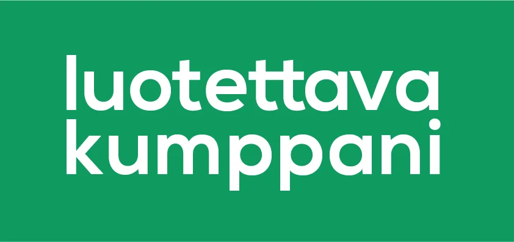</a>

            

          

        

      

    </section>

  

  

  

  

  

  

  

